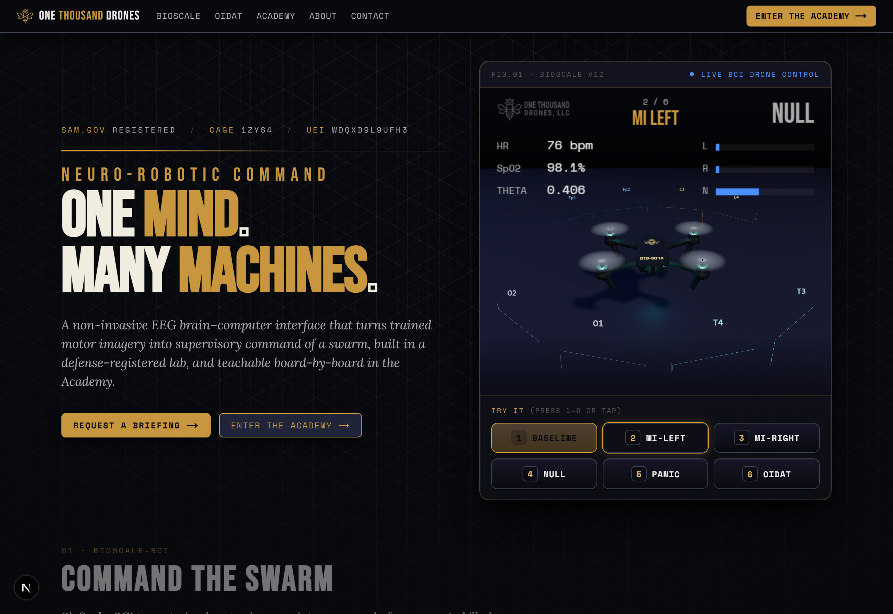
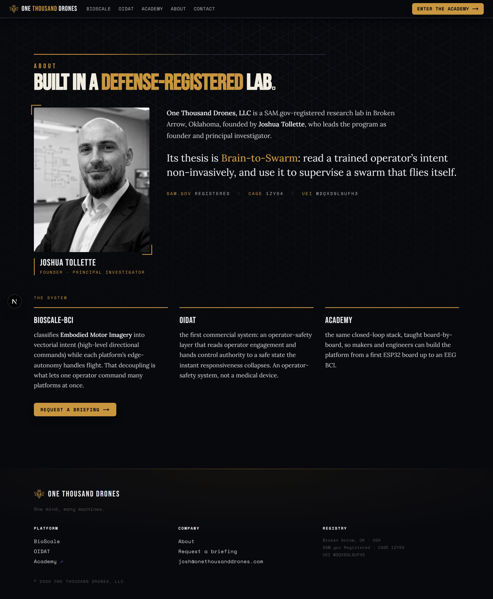
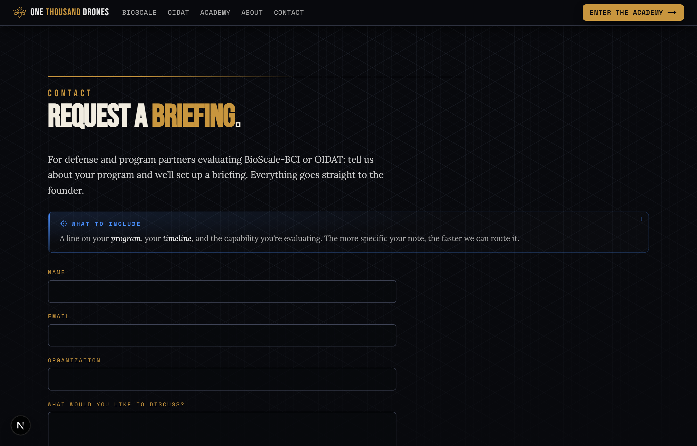

# One Thousand Drones

> © One Thousand Drones, LLC. All rights reserved. This repo is public for transparency and
> reference; the code is **not** licensed for reuse, fork, or derivative work.

**Production:** https://onethousanddrones.com
**Repo:** https://github.com/Otd-llc/otd-site

The public hub for **One Thousand Drones, LLC** — a SAM.gov-registered defense research lab
(CAGE 1ZYS4 · UEI WDQXD9L9UFH3). It states the company's thesis and routes visitors two ways:
into the live **BioScale** brain-computer-interface demo, or into the **Academy**.

The thesis — *Brain-to-Swarm*: a non-invasive EEG BCI that reads a trained operator's intent
(motor imagery) and uses it to **supervise** a swarm that flies itself — one mind, many machines.

## Screenshots

| Home — Brain-to-Swarm hub + live BioScale BCI demo |
| :---: |
| [](docs/screenshots/home.png) |

| About — founder dossier | Contact — request a briefing |
| :---: | :---: |
| [](docs/screenshots/about.png) | [](docs/screenshots/contact.png) |

## What's here

- **Home** (`/`) — the Brain-to-Robotic-Command hero, the **live BioScale BCI demo** embedded
  from `demo.onethousanddrones.com` (an `<iframe …/?embed=1>` with a `postMessage` bridge), and the
  product/spec sections (BioScale-Q / BioScale-16) with calls to request a briefing or enter the Academy.
- **About** (`/about`) — a founder dossier: principal investigator, the thesis, and the three-part
  system — **BioScale-BCI** (Embodied Motor Imagery → vectorial intent), **OIDAT** (operator-safety
  layer), and the **Academy** (the same closed-loop stack, taught board-by-board).
- **Contact** (`/contact`) — a "request a briefing" form. Submissions `POST /api/contact`, which
  emails the founder via **Resend**. A hidden honeypot drops bots; both the client gate and the
  server route validate independently.

## Tech stack

- **Next.js 16** (App Router, RSC) · **React 19** · **TypeScript 5**
- **Resend** for transactional email (the briefing form)
- Hand-rolled CSS (`app/globals.css`), no component framework — dark + command-gold brand matched
  to the Academy (Bebas Neue / Space Mono / serif), with alternating-gold page titles + a shared
  elevation/scroll-reveal system
- **Vitest** — covers the `/api/contact` route (validation + honeypot + a mocked Resend) and the
  client `BriefingForm` validation gate
- **Vercel** — auto-deploys on push to `main` (branch-protected: PR + a passing build required)

## Local development

```bash
pnpm install
pnpm dev          # http://localhost:3000
pnpm test         # vitest
pnpm lint
```

Env vars (the contact form needs the first three):

- `RESEND_API_KEY` — Resend API key
- `CONTACT_FROM_EMAIL` / `CONTACT_TO_EMAIL` — the briefing email's from/to
- `NEXT_PUBLIC_DEMO_URL` — optional; the embedded BioScale demo origin (defaults to
  `https://demo.onethousanddrones.com`)

## Related

- **Academy** — https://academy.onethousanddrones.com (`Otd-llc/otd-academy`)
- **BioScale demo** — https://demo.onethousanddrones.com (embedded on the home page)
